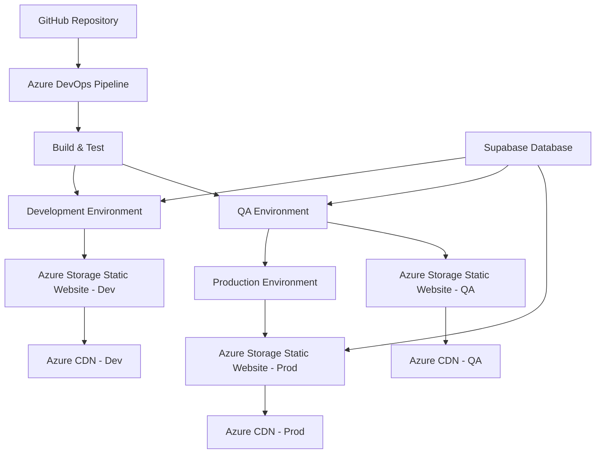

# College Attendance System - Deployment Guide

This guide provides step-by-step instructions for setting up the DevOps pipeline and deploying the College Attendance System using Azure DevOps and Azure Static Web Apps.

## Architecture Overview



## Prerequisites

1. **Azure Subscription** with appropriate permissions
2. **Azure DevOps Organization** and Project
3. **GitHub Repository** with the attendance system code
4. **Supabase Account** for the database backend
5. **Node.js 18+** for local development

## Step 1: Azure Resource Setup

### 1.1 Create Resource Group

```bash
# Create a resource group for all resources
az group create \
  --name "rg-attendance-system" \
  --location "East US 2"
```

### 1.2 Create Storage Accounts

Create separate storage accounts for each environment:

```bash
# Development Storage Account
az storage account create \
  --name "saattendancedev001" \
  --resource-group "rg-attendance-system" \
  --location "East US 2" \
  --sku "Standard_LRS" \
  --kind "StorageV2"

# Enable static website hosting
az storage blob service-properties update \
  --account-name "saattendancedev001" \
  --static-website \
  --index-document "index.html" \
  --404-document "404.html"

# QA Storage Account
az storage account create \
  --name "saattendanceqa001" \
  --resource-group "rg-attendance-system" \
  --location "East US 2" \
  --sku "Standard_LRS" \
  --kind "StorageV2"

az storage blob service-properties update \
  --account-name "saattendanceqa001" \
  --static-website \
  --index-document "index.html" \
  --404-document "404.html"

# Production Storage Account
az storage account create \
  --name "saattendanceprod001" \
  --resource-group "rg-attendance-system" \
  --location "East US 2" \
  --sku "Standard_ZRS" \
  --kind "StorageV2"

az storage blob service-properties update \
  --account-name "saattendanceprod001" \
  --static-website \
  --index-document "index.html" \
  --404-document "404.html"
```

### 1.3 Create CDN Profiles and Endpoints

```bash
# Create CDN Profile
az cdn profile create \
  --name "cdn-attendance-system" \
  --resource-group "rg-attendance-system" \
  --sku "Standard_Microsoft"

# Development CDN Endpoint
az cdn endpoint create \
  --name "attendance-dev" \
  --profile-name "cdn-attendance-system" \
  --resource-group "rg-attendance-system" \
  --origin "saattendancedev001.z13.web.core.windows.net" \
  --origin-host-header "saattendancedev001.z13.web.core.windows.net"

# QA CDN Endpoint
az cdn endpoint create \
  --name "attendance-qa" \
  --profile-name "cdn-attendance-system" \
  --resource-group "rg-attendance-system" \
  --origin "saattendanceqa001.z13.web.core.windows.net" \
  --origin-host-header "saattendanceqa001.z13.web.core.windows.net"

# Production CDN Endpoint
az cdn endpoint create \
  --name "attendance-prod" \
  --profile-name "cdn-attendance-system" \
  --resource-group "rg-attendance-system" \
  --origin "saattendanceprod001.z13.web.core.windows.net" \
  --origin-host-header "saattendanceprod001.z13.web.core.windows.net"
```

## Step 2: Supabase Configuration

### 2.1 Create Supabase Project

1. Visit [https://supabase.com](https://supabase.com)
2. Create a new project
3. Note down the Project URL and API keys
4. Run the SQL schema from `database/supabase-schema.sql`

### 2.2 Environment Variables

Create environment-specific configurations:

**Development:**
```env
VITE_SUPABASE_URL=https://your-dev-project.supabase.co
VITE_SUPABASE_ANON_KEY=your-dev-anon-key
VITE_APP_ENV=development
```

**QA:**
```env
VITE_SUPABASE_URL=https://your-qa-project.supabase.co
VITE_SUPABASE_ANON_KEY=your-qa-anon-key
VITE_APP_ENV=qa
```

**Production:**
```env
VITE_SUPABASE_URL=https://your-prod-project.supabase.co
VITE_SUPABASE_ANON_KEY=your-prod-anon-key
VITE_APP_ENV=production
```

## Step 3: Azure DevOps Configuration

### 3.1 Create Azure DevOps Project

1. Navigate to [dev.azure.com](https://dev.azure.com)
2. Create a new project: "College-Attendance-System"
3. Connect to your GitHub repository

### 3.2 Create Service Connection

1. Go to **Project Settings** > **Service connections**
2. Create **Azure Resource Manager** connection
3. Name it: `azure-attendance-system`
4. Grant access to your resource group

### 3.3 Create Variable Groups

Create a variable group named `AttendanceSystem-Variables`:

| Variable Name | Value | Secret |
|---------------|-------|---------|
| resourceGroup | rg-attendance-system | No |
| devStorageAccount | saattendancedev001 | No |
| qaStorageAccount | saattendanceqa001 | No |
| prodStorageAccount | saattendanceprod001 | No |
| devCdnProfile | cdn-attendance-system | No |
| qaCdnProfile | cdn-attendance-system | No |
| prodCdnProfile | cdn-attendance-system | No |
| devCdnEndpoint | attendance-dev | No |
| qaCdnEndpoint | attendance-qa | No |
| prodCdnEndpoint | attendance-prod | No |
| azureServiceConnection | azure-attendance-system | No |

### 3.4 Create Environments

Create three environments with approvals:

1. **development** - No approvals required
2. **qa** - Require approval from QA team
3. **production** - Require approval from senior developers/managers

## Step 4: Pipeline Setup

### 4.1 Create Pipeline

1. Go to **Pipelines** > **New pipeline**
2. Select **GitHub** as source
3. Select your repository
4. Use **Existing Azure Pipelines YAML file**
5. Select `/azure-pipelines.yml`

### 4.2 Configure Branch Policies

Set up branch protection rules in GitHub:

1. Require pull request reviews
2. Require status checks (build)
3. Require up-to-date branches
4. Include administrators

## Step 5: Package.json Scripts

Ensure your `package.json` includes these scripts:

```json
{
  "scripts": {
    "dev": "vite",
    "build": "tsc && vite build",
    "lint": "eslint . --ext ts,tsx --report-unused-disable-directives --max-warnings 0",
    "preview": "vite preview",
    "test": "vitest",
    "test:coverage": "vitest run --coverage"
  }
}
```

## Step 6: Deployment Process

### 6.1 Development Deployment
- Triggered automatically on push to `develop` branch
- No approval required
- Deployed to: `https://attendance-dev.azureedge.net`

### 6.2 QA Deployment
- Triggered automatically on push to `main` branch
- Requires QA team approval
- Deployed to: `https://attendance-qa.azureedge.net`

### 6.3 Production Deployment
- Triggered after successful QA deployment
- Requires senior approval
- Deployed to: `https://attendance-prod.azureedge.net`

## Step 7: Monitoring and Logging

### 7.1 Enable Application Insights

```bash
az monitor app-insights component create \
  --app "attendance-system-insights" \
  --location "East US 2" \
  --resource-group "rg-attendance-system" \
  --kind "web"
```

### 7.2 Configure Alerts

Set up alerts for:
- Application errors
- Performance degradation
- High response times
- Failed deployments

## Step 8: Security Considerations

### 8.1 Key Vault (Optional)

For production environments, consider using Azure Key Vault:

```bash
az keyvault create \
  --name "kv-attendance-system" \
  --resource-group "rg-attendance-system" \
  --location "East US 2"
```

### 8.2 Content Security Policy

Add CSP headers to your static website configuration:

```json
{
  "globalHeaders": {
    "Content-Security-Policy": "default-src 'self'; script-src 'self' 'unsafe-eval'; style-src 'self' 'unsafe-inline';"
  }
}
```

## Step 9: Custom Domain Setup (Optional)

### 9.1 Add Custom Domain to CDN

```bash
az cdn custom-domain create \
  --endpoint-name "attendance-prod" \
  --profile-name "cdn-attendance-system" \
  --resource-group "rg-attendance-system" \
  --name "attendance-yourdomain" \
  --hostname "attendance.yourdomain.com"
```

### 9.2 Enable HTTPS

```bash
az cdn custom-domain enable-https \
  --endpoint-name "attendance-prod" \
  --profile-name "cdn-attendance-system" \
  --resource-group "rg-attendance-system" \
  --name "attendance-yourdomain"
```

## Troubleshooting

### Common Issues

1. **Build Failures**
   - Check Node.js version compatibility
   - Verify all dependencies are listed in package.json
   - Review build logs for specific error messages

2. **Deployment Failures**
   - Verify Azure service connection permissions
   - Check storage account access keys
   - Ensure CDN endpoint configuration is correct

3. **Environment Variables**
   - Verify Supabase URLs and keys are correct
   - Check variable group configuration in Azure DevOps
   - Ensure secrets are properly marked as secure

### Useful Commands

```bash
# Check pipeline status
az pipelines run list --project "College-Attendance-System"

# View storage account static website
az storage blob service-properties show \
  --account-name "saattendanceprod001" \
  --services b

# Purge CDN cache manually
az cdn endpoint purge \
  --resource-group "rg-attendance-system" \
  --profile-name "cdn-attendance-system" \
  --name "attendance-prod" \
  --content-paths "/*"
```

## Cost Optimization

1. **Storage Tiers**: Use appropriate storage tiers for different environments
2. **CDN Caching**: Configure proper cache headers and rules
3. **Resource Cleanup**: Implement automated cleanup for development resources
4. **Monitoring**: Set up cost alerts and budgets

## Next Steps

1. Set up automated testing (unit, integration, e2e)
2. Implement infrastructure as code (ARM/Bicep templates)
3. Add security scanning to the pipeline
4. Configure backup and disaster recovery
5. Implement feature flags for gradual rollouts

## Support and Documentation

- **Azure DevOps**: [https://docs.microsoft.com/azure/devops/](https://docs.microsoft.com/azure/devops/)
- **Azure Static Web Apps**: [https://docs.microsoft.com/azure/static-web-apps/](https://docs.microsoft.com/azure/static-web-apps/)
- **Supabase**: [https://supabase.com/docs](https://supabase.com/docs)
- **React + Vite**: [https://vitejs.dev/guide/](https://vitejs.dev/guide/)